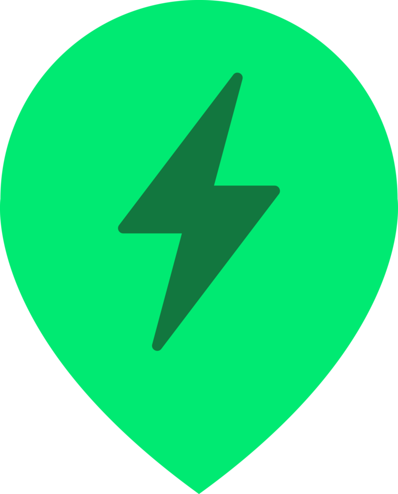

# ⚡ ChargeLink — Smart EV Charging & Mobility Platform

<p align="center">
  
</p>

<p align="center">
  <b>An Intelligent Peer-to-Peer EV Charging Ecosystem & Smart Mobility Network</b><br>
  Built with Flutter, Cloud Firestore, Firebase Auth, Google Maps Platform & AI Smart Recommendation Engine.
</p>

<p align="center">
  
  
  
  
  
  
</p>

---

## 📌 Problem Statement & Vision

As electric vehicle adoption surges, EV drivers face critical bottlenecks: **range anxiety**, **fragmented private/public charging infrastructure**, **uncertain station availability**, and **long queues**. At the same time, private residential and commercial charger owners have idle infrastructure that could be monetized.

**ChargeLink** bridges this gap:
1. **For EV Drivers**: Discover, compare, filter, reserve charging slots with live pricing, navigate, and monitor real-time charging telemetry.
2. **For Station Hosts**: List private/commercial chargers, control live availability, verify driver check-in PINs, and track revenue and power dispensed in real-time.
3. **Smart Mobility Intelligence**: Multi-factor AI algorithm recommending optimal chargers based on battery level, driving distance, pricing, and charging power, paired with a long-distance EV trip & waypoint planner.

---

## 🚀 Key Features

### 🚗 1. For EV Drivers (Customers)
- **Interactive Google Maps Hub**: Real-time Firestore station markers with custom pins and auto-centering device GPS.
- **Multi-Criteria Filter Engine**: Filter by current type (`AC` / `DC Fast`), connector standard (`CCS2`, `Type 2`, `CHAdeMO`), minimum power output ($7.4\text{ kW} - 120\text{ kW}$), and availability status.
- **Interactive Slot Reservation**:
  - 7-Day Date Picker & dynamic time slot chips.
  - Duration selection ($30\text{m}$, $45\text{m}$, $1\text{h}$, $1.5\text{h}$, $2\text{h}$).
  - Battery capacity & target percentage slider with instant $kWh$ and price estimation.
  - **Secure 4-Digit Check-in PIN** generated per booking for station verification.
- **My Bookings Activity Center**: Tabbed management for `Upcoming`, `In Progress`, and `Past` sessions with digital check-in PIN access and cancellation safeguards.
- **✨ AI Smart Match Recommender**: Multi-factor scoring engine ranking stations by *⚡ AI Optimal*, *Fastest*, *Best Value (Cheapest)*, or *Nearest*, with transparent AI reasoning narrative.
- **🗺️ EV Trip & Route Planner**: Enter origin and destination (e.g. *Nerul $\rightarrow$ Pune*) with live battery range calculation and automated highway waypoint fast-charger recommendations.
- **⚡ Live Session Telemetry Simulator**: Ambient dark theme charging gauge with circular neon pulse animation, real-time $kWh$ delivered counter, charging speed ($kW$), live cost ticker, and digital receipt generation.

---

### 🏢 2. For Station Hosts (Owners)
- **Host Dashboard**: Live top-line metrics: *Active Stations*, *Today's Reserved Slots*, and *Total Revenue (₹)*.
- **Add New Charger Form**: Register station with auto-detected GPS coordinates, current type, connector standards, power rating, and customizable $₹/\text{kWh}$ rate.
- **Manage Chargers**: Real-time status switch (`Online & Available` $\leftrightarrow$ `Offline / Maintenance`) and station deletion.
- **Booking Requests & PIN Verification**: Host checks driver's 4-digit PIN to activate sessions and mark them completed.
- **Revenue & Power Analytics**: Real-time breakdown of gross earnings, total $kWh$ dispensed, and star review ratings.
- **Station Profile**: Manage business details, contact info, and payout settings.

---

## 🛠️ Technology Stack

| Layer | Technology |
|---|---|
| **Frontend Framework** | [Flutter](https://flutter.dev/) (v3.44+) / Dart (v3.12+) |
| **UI Design System** | Material 3, Emerald Green (`#00C853`) Ambient Theme |
| **Authentication** | Firebase Authentication (Email / Password) |
| **Database** | Cloud Firestore (Real-time NoSQL stream subscriptions) |
| **Mapping & Location** | `google_maps_flutter`, `geolocator` |
| **State & Lifecycle** | Reactive Flutter Stateful architecture with stream listeners and controller disposals |

---

## 🏗️ System Architecture

```
                    ┌─────────────────────────────────────────┐
                    │               ChargeLink                │
                    └────────────────────┬────────────────────┘
                                         │
        ┌────────────────────────────────┴────────────────────────────────┐
        │                                                                 │
  [🚗 Customer App]                                              [🏢 Host Dashboard]
   ├── Map & Location Services                                    ├── Add Station (GPS auto-fill)
   ├── Multi-Factor AI Recommender                                ├── Live On/Off Availability Switch
   ├── Slot Reservation & Pricing                                ├── Driver PIN Check-in Verifier
   ├── Trip & Waypoint Planner                                    ├── Earnings & Power Analytics
   └── Live Charging Telemetry                                    └── Profile & Payouts
        │                                                                 │
        └────────────────────────────────┬────────────────────────────────┘
                                         │
                    ┌────────────────────┴────────────────────┐
                    │            Cloud Firestore              │
                    │   ├── users/{uid}                       │
                    │   ├── chargers/{chargerId}              │
                    │   └── bookings/{bookingId}              │
                    └─────────────────────────────────────────┘
```

---

## 📂 Project Structure

```text
lib/
├── app.dart                          # Root MaterialApp & Route configuration
├── firebase_options.dart             # Firebase platform options
├── main.dart                         # App initialization & status bar styling
│
├── core/
│   └── theme/
│       ├── app_colors.dart           # Emerald EV color palette
│       └── app_theme.dart            # Global Material 3 theme data
│
├── models/
│   ├── booking_model.dart            # Booking schema with OTP PIN & timestamps
│   ├── charger_model.dart            # Charger specifications, coordinates & rating
│   ├── charging_session_model.dart   # Live session telemetry data
│   ├── review_model.dart             # User review & rating model
│   └── user_model.dart               # User profile & role definition
│
├── screens/
│   ├── auth/
│   │   ├── forgot_password_screen.dart # Password reset with confirmation state
│   │   ├── login_screen.dart           # Sign-in with role-based redirection
│   │   ├── register_screen.dart        # 5-field account registration
│   │   └── role_selection_screen.dart  # Interactive Driver vs Host selection
│   │
│   ├── customer/
│   │   ├── ai/
│   │   │   └── smart_recommendation_sheet.dart # AI Smart Match bottom sheet
│   │   ├── booking/
│   │   │   ├── booking_screen.dart             # Slot reservation & pricing estimator
│   │   │   └── my_bookings_screen.dart         # 3-tab activity center
│   │   ├── charger/
│   │   │   └── charger_detail_sheet.dart       # Station specifications modal
│   │   ├── home/
│   │   │   └── customer_home.dart              # Fullscreen Map, search & smart pills
│   │   ├── session/
│   │   │   └── active_session_screen.dart      # Live charging gauge & receipt
│   │   └── trip/
│   │       └── trip_planner_screen.dart        # Route & waypoint stop planner
│   │
│   ├── owner/
│   │   ├── add_charger/
│   │   │   └── add_charger_screen.dart         # Station publication form
│   │   ├── analytics/
│   │   │   └── host_analytics_screen.dart      # Earnings & power dispensed metrics
│   │   ├── bookings/
│   │   │   └── host_bookings_screen.dart       # PIN check-in & session manager
│   │   ├── chargers/
│   │   │   └── manage_chargers_screen.dart     # Host station listings & toggle
│   │   ├── home/
│   │   │   └── owner_home.dart                 # Central host dashboard
│   │   └── profile/
│   │       └── host_profile_screen.dart        # Host profile & payout details
│   │
│   └── splash/
│       └── splash_screen.dart                  # Gradient entry animation
│
├── services/
│   ├── ai_recommendation_service.dart          # Multi-criteria scoring algorithm
│   ├── auth_service.dart                       # Firebase Auth & role management
│   ├── booking_service.dart                    # Booking CRUD & PIN generation
│   └── charger_service.dart                    # Station CRUD & auto-seeding
│
└── widgets/
    ├── cards/
    │   └── charger_card.dart                   # Horizontal station card
    └── common/
        └── filter_sheet.dart                   # Multi-criteria filter sheet
```

---

## ⚡ Getting Started

### Prerequisites
- [Flutter SDK](https://docs.flutter.dev/get-started/install) (v3.20.0 or higher)
- [Android Studio](https://developer.android.com/studio) or [VS Code](https://code.visualstudio.com/)
- Active [Firebase Project](https://console.firebase.google.com/)
- [Google Maps API Key](https://developers.google.com/maps/documentation/android-sdk/get-api-key)

### Installation & Run

1. **Clone the Repository**:
   ```bash
   git clone https://github.com/Rushiii77/ChargeLink.git
   cd ChargeLink/app
   ```

2. **Install Dependencies**:
   ```bash
   flutter pub get
   ```

3. **Configure Google Maps API Key**:
   In `android/app/src/main/AndroidManifest.xml`:
   ```xml
   <meta-data
       android:name="com.google.android.geo.API_KEY"
       android:value="YOUR_GOOGLE_MAPS_API_KEY"/>
   ```

4. **Run the Application**:
   ```bash
   # Run on connected Android Emulator or Physical Device
   flutter run
   ```

---

## 🔮 Future Roadmap (Smart India Hackathon & Beyond)

- [ ] **OCPP 2.0.1 Protocol Integration**: Direct IoT hardware bridge to commercial chargers.
- [ ] **Payment Gateway**: Integrated Razorpay & UPI automated settlement escrow.
- [ ] **Dynamic Grid Load Balancing**: AI-driven power throttling during peak grid hours.
- [ ] **Carbon Offset Tracker**: Display total $CO_2$ emissions saved per charging session.

---

## 📄 License
This project is licensed under the MIT License — see the [LICENSE](LICENSE) file for details.

---

<p align="center">
  Developed with 💚 for the EV Charging Revolution.
</p>
